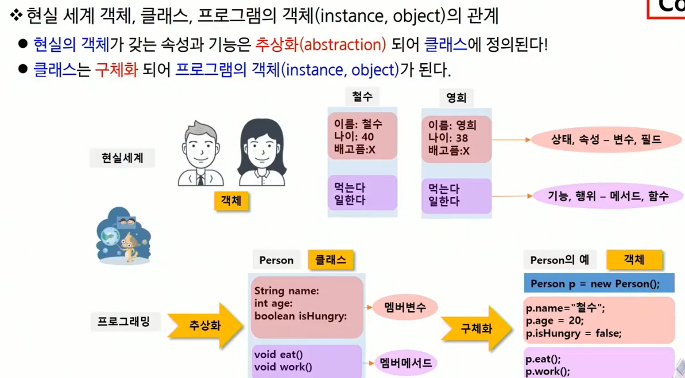
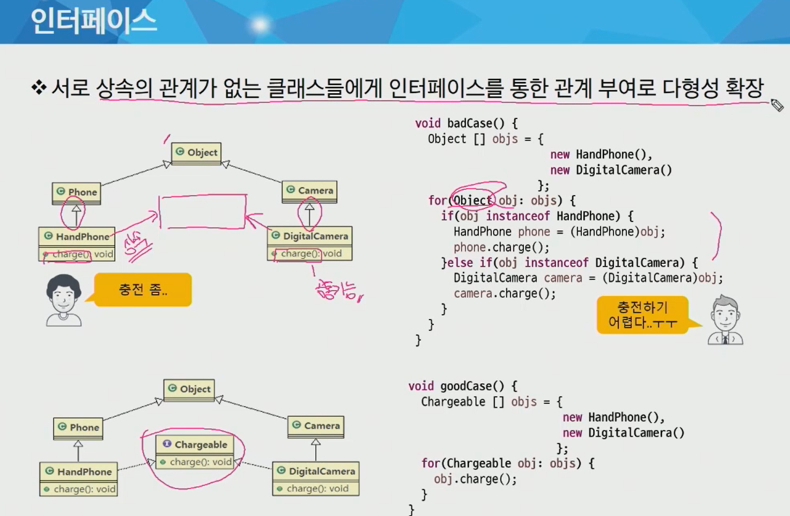

## 객체지향 언어의 특징

Java is **A PIE**

| 특성                              | 내용                                                         |
| --------------------------------- | ------------------------------------------------------------ |
| Abstraction(추상화)               | 현실의 객체를 추상화하여 클래스를 구성한다.                  |
| Polymorphism(다형성)              | 하나의 객체를 여러가지 타입(형)으로 참조할 수 있다.          |
| Inheritance(상속)                 | 부모 클래스의 자산을 물려받아 자식을 정의함으로 코드의 재사용이 가능하다. |
| Eucapsulation(데이터 은닉과 보호) | 데이터를 외부에 직접 노출시키지 않고 메서드를 이용해 보호할 수 있다. |


### 객체

1. 주체가 아닌 것, 주체가 활용하는 것
   1. 우리 주변에 있는 모든 것은 프로그래밍의 대상: 사물, 개념, 논리

2. 객체지향 프로그래밍
   1. 주변의 많은 것들을 객체화 해서 프로그래밍 하는 것 
   2. 객체지향은 객체를 많이 만드는 것을 추천한다?
3. 장점
   1. 신뢰성 높은 프로그래밍이 가능하다
   2. 추가/수정/삭제가 용이
   3. 재 사용성이 높다


객체는 크게 **클래스**와 **인스턴스**로 나눠진다.

객체는 특정 타입(클래스)의 인스턴스이다.

메서드는 특정 객체에 적용될 수 있는 행위를 뜻하며, 일반적으로 클래스에 정의된 함수.


현실의 객체가 갖는 속성과 기능은 추상화되어 클래스에 정의된다.
클래스는 구체화 되어 프로그램의 객체가 된다.




## **상속**

1. 기존 클래스의 자산(멤버)을 자식 클래스에서 재사용하기 위한 것

2. 기존 클래스의 멤버를 물려 받기 때문에 코드의 절감
   (유지 보수성 향상)

3. 프로그래밍의 상속은 부모가 물려주는 것이 아니라 자식이 직접 가져오는 방식

4. 상속의 적용
   ```java
   public class Person {
       //속성
       String name;
       
       //기능
       void eat(){}
       void jump(){}
   }
   
   public class SpiderMan extends Person {
       boolean isSpider;
       void fireWeb(){}
   }
   ```

   ``` tip
   Tip - Object 클래스
   
   모든 클래스의 조상 클래스
   
   1. 별도의 extends 선언이 없는 클래스들은 extends Object가 생략됨
   2. 따라서 모든 클래스에는 Object 클래스에 정의된 메서드가 있음
   ```

5. 상속의 관계는 is a 관계라고 함

   - Person is a Object
   - SpiderMan is a Person
   - SpiderMan is a Spiderman
   - SpiderMan is a Object

   

6. 단일 상속 (Single Inheritance)

   - 다중 상속의 경우 여러 클래스의 기능을 물려받을 수 있으나 관계가 매우 복잡해짐
     동일한 이름의 메서드가 두 부모에게 있다면 자식은 어떤 메서드를 쓸 것인가?
   - 자바는 단일 상속만 지원
     대신 interface와 **포함 관계(has a)**로 단점 극복

   ```java
   public class SpiderMan2 extends Person {
       Spider spider = new Spider();  // has a 포함관계
       boolean isSpider;
       
       void fireWeb() {
           if (isSpider) {
               spider.fireweb();
           } else {
             System.out.println("Person은 거미줄 발사 불가");
           }
       }
   }
   // Person을 상속받고 Spider를 포함하는 클래스
   ```

   - 어떤 클래스를 상속 받고 어떤 클래스를 포함해야 하는가?
     이는 문법적인 문제가 아니라 프로젝트 관점의 문제


#### 메서드 오버라이딩

조상 클래스에 정의된 메서드를 자식 클래스에서 적합하게 수정하는 것

조건

1. 메서드의 이름이 같아야 한다.
2. 매개 변수의 개수, 타입, 순서가 같아야 한다.
3. 리턴 타입이 같아야 한다.
4. 접근 제한자는 부모 보다 범위가 넓거나 같아야 한다.
5. 조상보다 더 큰 예외를 던질 수 없다.

```java
public class SpiderMan extends Person {
    // has a 관계
    Spider spider = new Spider();
    
    boolean isSpider;
    void fireWeb(){}
    
    // jump는 Person의 메서드인데 아쉬워서 다시 재정의
    @Override // annotation: 주석 (사람이 보는 주석이 아니라 프레임워크, 시스템이 보는 주석) // 아래 anntation 참조
    void jump() {
        if(isSpider) {
            spider.jump();  //Person의 jump는 아쉬워서 포함관계인 spider의 jump로 재정의
        } else {
            System.out.println("폴짝")
         // super.jump();  도 가능(기존 Person의 jump가 "폴짝"을 출력하는 것이었다면!!)
         // super는 조상을 의미하기 때문에 Person.jump()를 의미하는 super.jump()를 적어주는 것!
         // 아래 super 키워드 참조!!
        }
    }
}
```

#### annotation

JDK 1.5의 기본 annotation의 예

1. @Deprecated
   - 컴파일러에게 해당 메서드가 deprecated 되었다고 알려줌
     해당 함수에 중간 취소선이 그어짐 
     (이건 vscode나 eclipse가 Deprecated를 읽고 그어주는 것)
2. @Override
   - 컴파일러에게 해당 메서드는 overriode한 메서드임을 알려줌
   - @Override가 선언된 경우 반드시 super class에 선언되어있는 메서드여야 함
     (만약 위처럼 jump를 재정의하려고 했는데 jump2로 잘못 선언한 경우
     override에 실패했다고 알려줌)
3. @SuppressWarnings
   - 컴파일러에게 사소한 warning의 경우 신경 쓰지 말라고 알려줌


#### super 키워드

- 변수의 scope

  1. 사용된 위치에서 점점 확장해가며 처음 만난 선언부에 연결됨
  2. method 내부 -> 해당 클래스 멤버 변수 -> 조상 클래스 멤버 변수

  ```java
  class Parent{
      String x = "parent";
  }
  
  class Child extends Parent{
      String x = "child";
      
      void method(){
          String x = "method";
          System.out.println("x : " + x);  // method
          System.out.println("this.x : " + this.x);  // child
          System.out.println("super.x :" + super.x);  // parent
      }
  }
  
  // 명시적으로 this() 또는 super()를 호출하지 않는 경우 컴파일러가 super()를 삽입
  ```

 


## 추상클래스

- 조상 클래스에서 구현했지만 자손 클래서에서 반드시 override해서 사용하는 무의미한 메서드는
  선언부만 남기고 구현부는 세미콜론으로 대체

- 구현부가 없다는 의미로 abstract 키워드를 메서드 선언부에 추가

- 객체를 생성할 수 없는 클래스라는 의미로 클래스 선언부에 abstract를 추가

- ex
  ```java
  abstract class Vehicle {
      private int curX, curY;
      
      public void reportPosition() {
          System.out.println("현재 위치: (%d, %d)%n", curX, curY)
      }
      
      public abstract void addFuel();
  }
  ```

- 즉 일부는 그대로 사용하고 하나 이상의 메서드를 반드시 override해서 써야하는 경우에 사용
  (그냥 해당 메서드를 없애면 되지 않나? -> 반복문에서 addFuel()을 사용하려면 각각
  Suv든 ElectricCar든 모두 addFuel이 있는지 확인하고 있다면 addFuel() 코드를 짜야하는
  번거로움 발생)


추상 클래스(abstract class)는 상속 전용의 클래스

- 클래스에 구현부가 없는 메서드가 있으므로 객체를 생성할 수 없음

- 하지만 상위 클래스 타입로써 자식을 참조할 수는 있다.

  ```java
  // vehicle v = new Vehicle();  // abstract 클래스는 객체를 생성할 수 없다.
  Vehicle v = new DieselSUV();  // 대신 자식을 참조하는 것은 문제가 없음
  ```

  


## 인터페이스: 두개의 시스템 간의 접점

1. 인터페이스 작성
   1. 최고 수준의 추상화 단계: 모든 메서드가 abstract 형태
      - JDK 8에서 default method와 static method 추가 (body를 가짐)
   2. 형태
      - 클래스와 유사하게 interface 선언
      - 멤버 구성
        1. 모든 멤버변수는 public static final이며 생략 가능
        2. 모든 메서드는 public abstract이며 생략 가능
2. 인터페이스 상속
   - 클래스와 마찬가지로 인터페이스도 extends를 이용해 상속이 가능
   - 클래스와 다른 점은 인터페이스는 다중 상속이 가능
     (헷갈릴 메서드 구현 자체가 없기 때문)
   - 클래스에서 interface를 상속할때는 implements를 사용한다.
3. 인터페이스의 필요성
   - 구현을 강제로 표준화 처리 -> 손쉬운 모듈 교체
     (Printer가 바뀌어도 print()메서드는 동일!)
4. 서로 상속의 관계가 없는 클래스들에게 인터페이스를 통한 
   관계 부여로 다형성 확장
   